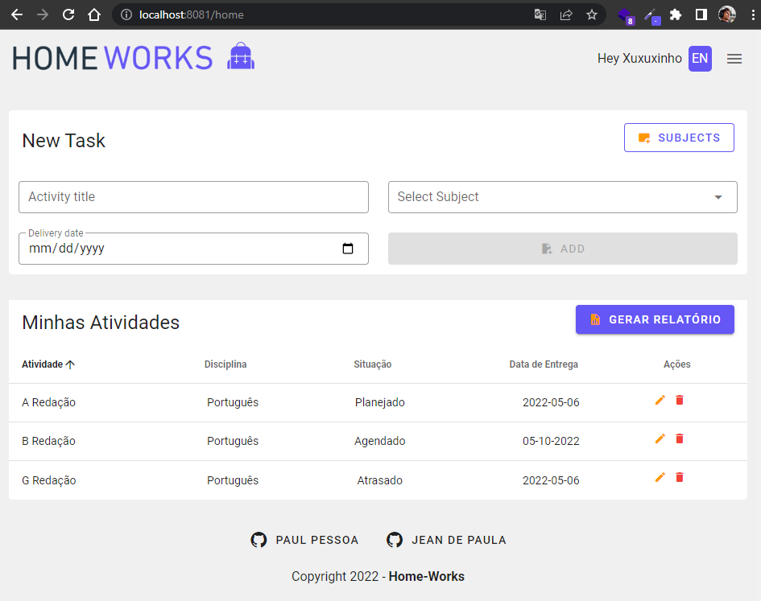
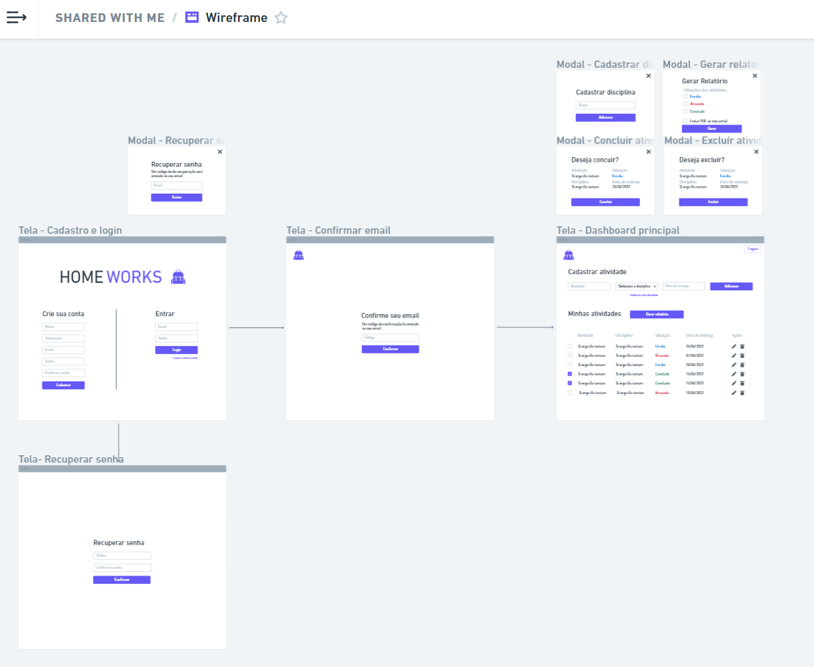

# Home Works - Done is better than perfect!

<a href="https://home-works.vercel.app/" target="_blank"></a>
## Components:

- [x] Cadastro
- [x] Verificação OTP E-mail (6 randômicos)
- [x] Login
- [ ] Recuperar Senha
- [ ] Editar Senha

- [ ] Cadastrar Disciplina
- [ ] Excluir Disciplina

- [x] Cadastrar atividade
- [x] Confirmação excluir atividade  
- [ ] Concluir atividade

- [x] Minhas Atividades (Tabela)
- [ ] Atividades Arquivadas (Tabela)

- [ ] Gerar relatório

 ## Extras:

- [ ] Multi Language
- [ ] Dark Theme


<a href="https://whimsical.com/wireframe-tdYmWwwSdqR4SqEoaFNUX" target="_blank"></a>


## Project setup
```
npm install
```

### Compiles and hot-reloads for development
```
npm run serve
```

### Compiles and minifies for production
```
npm run build
```

### Lints and fixes files
```
npm run lint
```

### Customize configuration
See [Configuration Reference](https://cli.vuejs.org/config/).
